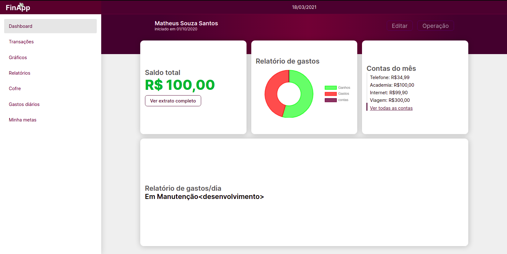
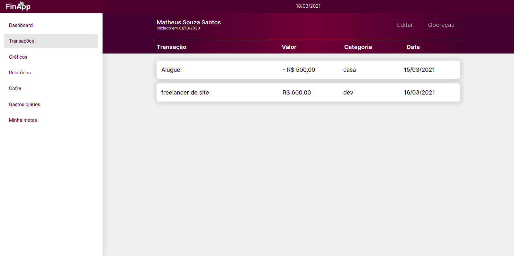

<h1 align="center">
    
</h1>

***

<h4 align="center"> 
	🚧 FinApp 1.0 💸 in development... 🚧
</h4>

***

<h3 align="center"> 
	Your financial app. we help you take care of your money!
</h3>
<br>

<p align="center">
 
 


</p>


<p align="center">
 <a href="#💻-about">About</a> •
 <a href="#⚙️-features">Features</a> •
 <a href="#🖥️-layout">Layout</a> • 
 <a href="#🚀-how-it-works">How it works</a> • 
 <a href="#tech-stack">Tech Stack</a> • 
 <a href="#contributors">Contributors</a> • 
 <a href="#author">Author</a> • 
 <a href="#user-content-license">License</a>

</p>

## 💻 About
***
💸 FinApp was developed with the aim of promoting education and financial control. In this web application you can make all your financial records to better control your money.

👨‍💻 The application is under development with [ReactJs](https://reactjs.org/) still without any integration with api, only with an interception of a fake api from [MirageJs](https://miragejs.com/) .

***

## ⚙️ Features
- [x] the application makes a request to the api that returns the user data:
   - [x] Username;
   - [x] id;
   - [x] cratedAt;
   - [x] transactions vector(financial transactions carried out by the user):
        - deposit transaction (cash inflow);
        - withdrawal transaction (outgoing money);

- [x] The user can register new transactions throughout their day to day and the app calculates their entire transaction history;
- [x] the user follows all the movement of his money through a graph of expenses and earnings;

***

## 🖥️ layout


<p align="center">(Dashboard)</p>

<p align="center">(Lista de transações)</p>

***

## 🚀 How it works

for the time being this project is under development, so we don't have a back-end or a mobile version yet.

but we can start the application in a development environment and make requests using [Mirage.Js](https://mirage.com).

### Pre-requisites

Before you begin, you will need to have the following tools installed on your machine:

Before you begin, you will need to have the following tools installed on your machine: [Git] (https://git-scm.com), [Node.js](https://nodejs.org/en/). In addition, it is good to have an editor to work with the code like [VSCode](https://code.visualstudio.com/).

#### Running the web application (Frontend)


```bash

# Clone this repository
$ git clone git@github.com:git@github.com:Matheusouz1/FinApp.git

# Access the project folder in your terminal
$ cd FinApp

# Install the dependencies
$ npm install or yarn install

# Run the application in development mode
$ npm run start or yarn sttart

# The application will open on the port: 3000 - go to http://localhost:3000

```
***

## Tech Stack

The following tools were used in the construction of the project:

-   **[TypeScript](https://www.typescriptlang.org/)**
-   **[ReactJs](https://reactjs.org)**
-   **[Styled-components](https://styled-components.com/)**
-   **[React Router Dom](https://github.com/ReactTraining/react-router/tree/master/packages/react-router-dom)**
-   **[React-modal](https://www.npmjs.com/package/react-modal)**
-   **[Axios](https://github.com/axios/axios)**
-   **[Chartjs](https://www.chartjs.org)**
-   **[MirageJs](https://miragejs.com)**

> See the file  [package.json](https://github.com/Matheusouz1/FinApp/package.json)

#### [](https://github.com/Matheusouz1/FinApp#utilit%C3%A1rios)**Utilitários**

-   Prototype:  **[Figma](https://www.figma.com/)**  →  **[Protótipo (Ecoleta)](https://www.figma.com/file/1SxgOMojOB2zYT0Mdk28lB/Ecoleta)**
-   Editor:  **[Visual Studio Code](https://code.visualstudio.com/)**  
-   Fonts:  **[Ubuntu](https://fonts.google.com/specimen/Ubuntu)**,  **[Inter](https://fonts.google.com/specimen/Inter)**

***

## Contributors

A big thanks to this group that made this product leave the field of idea and enter the app stores :)

You are an awesome team! :)

<table>
  <tr>
    <td align="center"><a href="https://www.instagram.com/matheus.tsx/"><br /><sub><b>Matheus Santos</b></sub></a><br /><a href="https://www.instagram.com/matheus.tsx/" title="Matheus Santos"></a></td>
  </tr>
  <tr>
    <td>
  </tr>
</table>

## How to contribute

1. Fork the project.
2. Create a new branch with your changes: `git checkout -b my-feature`
3. Save your changes and create a commit message telling you what you did: `git commit -m" feature: My new feature "`
4. Submit your changes: `git push origin my-feature`
> If you have any questions, please contact me by [clicking here!](https://api.whatsapp.com/send?phone=99991947191&text=Hello%20Matheus,%20your%20project%20is%20very%20cool,%20the%20FinApp!%20how%20can%20i%20contribute?)

***

## Author

<a href="https://www.instagram.com/matheus.tsx/"><br /><sub><b>Matheus Santos</b></sub></a><br /><a href="https://www.instagram.com/matheus.tsx/" title="Matheus Santos"></a>

***

## License

This project is under the license [MIT](./LICENSE).

Made by Matheus Santos 👋🏽 [Get in Touch!](https://www.linkedin.com/in/matheus-souza-santos-392677195/)

***

##  Versions of README

[English](/)  | 


